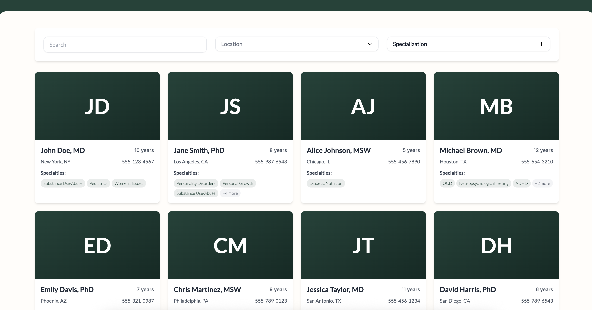
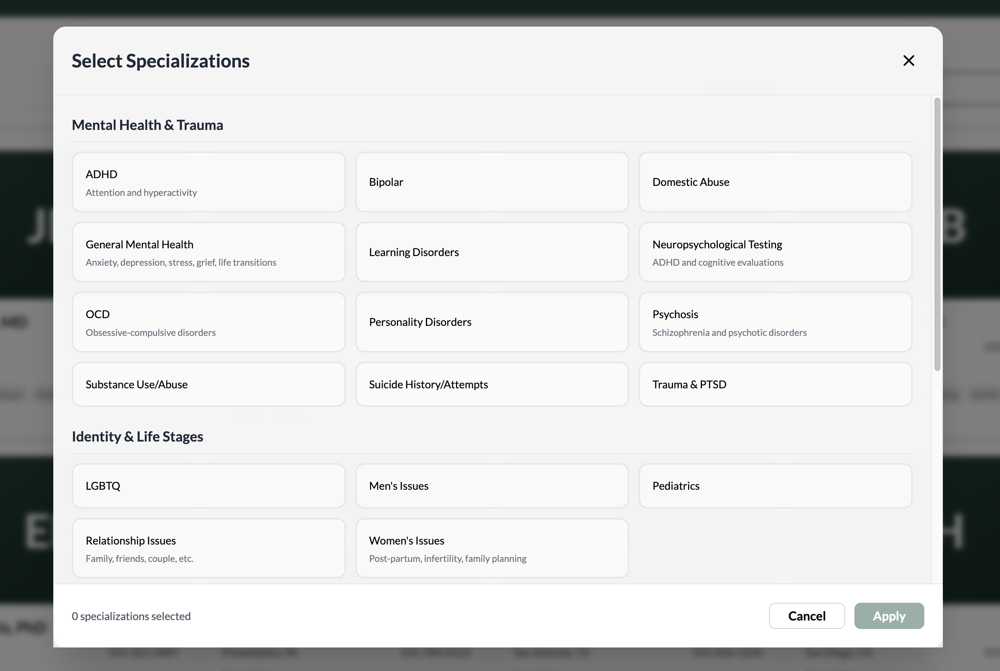

# Context for Maxxsure

Hello Maxxsure! I'm the frontend developer working with the recruiter Mike Cibulsky on the application for your joint Developer/Designer role.

Mike told me your team was very interseted in seeing a portfolio of previous deisgn work. I don't have a portfolio page- but figured this recent application I made as part of my interview with Solace Health would work.

The short version is this - Solace Health is a healthcare advocacy platform, and tasked me with taking their "advocate browser", and both rewriting the code, while enhancing the UI/UX.

In the Discussion.Md file, you can see my notes on my UI/UX rework- my thoughts, along with some screenshots of the application I build.

Feel free to reach out with any questions, thanks!

- Nate Reynolds

# What I'd change with more time

Hello, Solace Health! Thanks for considering my candidacy. I spent more time than requested on this assignment, but still cut myself short before I'd done everything possible.

Anyways, here's a list of things I'd have done with more time. Let me know if you have any questions - thanks!

## UI/UX Changes

A big theme with my UI/UX changes, would be understanding your business better- both regarding your users, as well as your business goals. There were some themes I saw with your product that made a lot of sense given your business, that I tried to honor here:

- **Only show exactly the elements a user needs to interact with, don't try to overwhelm them with information.**
- **Transitions should feel smooth, slow, and easy to follow.** The font style, the curved edges, etc.

### Main Interface

- **Add Year Filtering**: Allow users to filter advocates by years of experience.
- **Display Years of Experience differently**: I was unsatisfied with how it looks here. I'd really want to know how users should consider years of experience. Is having more always better (and therefore allowing folks to sort by YoE would be beneficial), or is more important that someone simply "isn't new, and is proven in their field" by having like 5+ years of experience? Do we have any other incentive to guide users to one advocate over an other? Whatever the answers are, they would inform how we present and highlight years of experience.
- **Candidate Order of Appearance:** I imagine users browse from the first advocate onward, left to right, row by row... so an advocate appearing higher in the list will get signficantly more engagement. For our business, our users, and our advocates sake... how do we want to list these candidates, knowing it'll impact their engagement rates? Alphabetically? In a random order every time? Or ordered by something else instead?
- **Photos, bios:** I added a placeholder spot (the advocates initials), because I thought including a photo would be important here. Picking a healthcare advocate requires a lot of trust, and seeing a face/reading a bio makes someone feel more human and trustworthy. Were this not available in our dataset, I'd design this page differently.
- **Learn More:** Some sort of "Learn more" link to go to a dedicated page about the individual could have been useful here (ex: to be able to see all of their specialties, to see their bio/other additional info)

### Specialty Filtering

- **Styling update:** There could have been more color contrast, and the modal could have faded into and out of view more smoothly.

The choice to use a modal was inspired by the thought "a user won't know the exact name we use for a category, but they'll know the right one when they see it". I wanted a screen that made it as visually easy as possible to browse and find the right specialty.

- **Refactor around selecting just one specialty:** Whether users need two or more specific specialties, informs a lot of design decisions. If in practice, users always needed only one specialty to filter on, I'd change this flow.
- **Synonym Search:** If the grouping needing tweaks, more specialties were to be added, or if anything else made it more difficult to visually organize the specialties like this modal- a search bar could be useful to find the desired specialty.

Following the principle of "users don't know our specialty terms coming in, but they'll know the right term when they see it", means that such a search bar would need to understand each specialties synonym terms, incase a user tried to type that instead (ex: Obsessive Compulsive Disorder could showup if a user types 'OCD')

### Tablet/Mobile views

The current design is servicable on tablet and mobile devices, but there are opportunities for improvement in touch interactions and layout adjustments.

## Unit Testing

With time I'd have added unit tests with jest- especially to test the filter logic.

## Code Cleanup

A few ideas could have been worth implementing with more time, like:

- **Standalone Components:** Break down large components into smaller, reusable ones (ex: The AdvocateCard component)
- **Better theme usage:** Add more universal style properties, like various durations for animation transitions- I was hard coding them here.

## Data Management

It could make sense for the text representation of locations, specialties, etc. to be included as filterOptions from the backend, instead of static types on the front end.

---

*This document outlines potential improvements and features that could be implemented given additional development time and resources.*